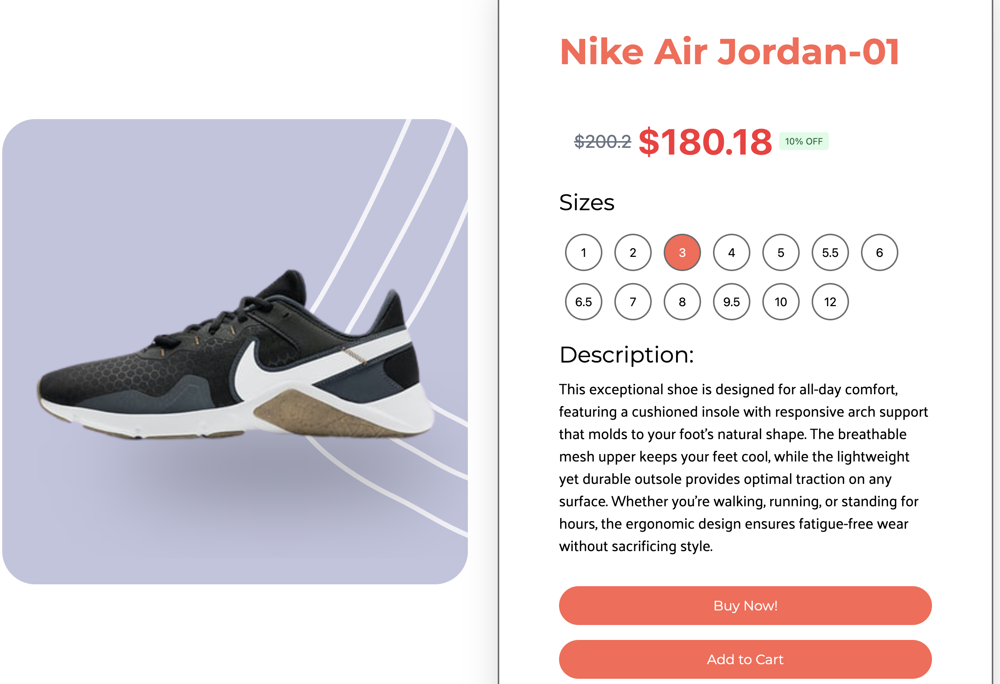

# Nike Website Clone

This project is used to demonstrate my understanding of React.js and Tailwind CSS. The tutorial can be found on JavaScript Mastery's Youtube Channel [Here](https://www.youtube.com/watch?v=_W3R2VwRyF4). A products page was added for additional challenge, as well as making the home button functional.



## Technologies Used

- React.js
- Tailwind CSS

### Prerequisites

- Node.js v18+
- npm or yarn

### Installation

1. Clone the repository:

   ```bash
   git clone https://github.com/mc7192/nike-clone.git
   ```

2. Install dependencies

   ```
   npm install
   # or
   yarn install
   ```

3. Start development server

   ```
   npm run dev
   # or
   yarn dev

   ```
